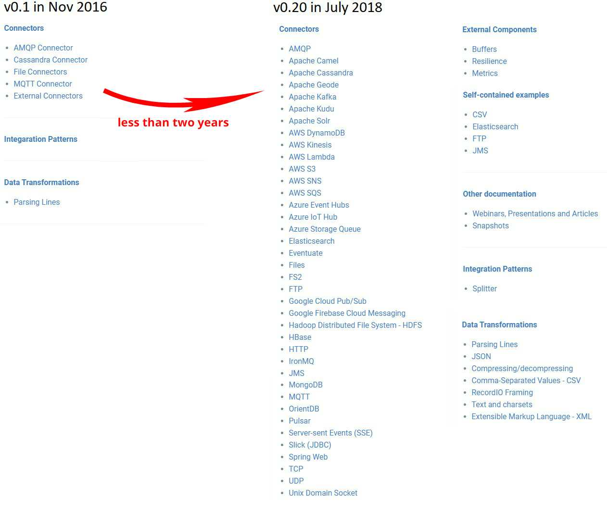
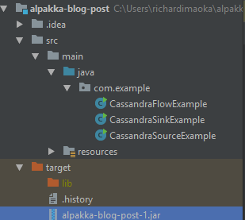
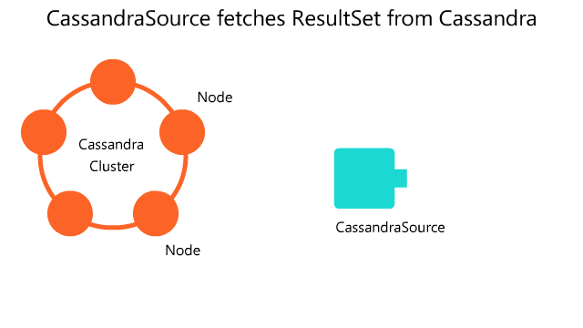
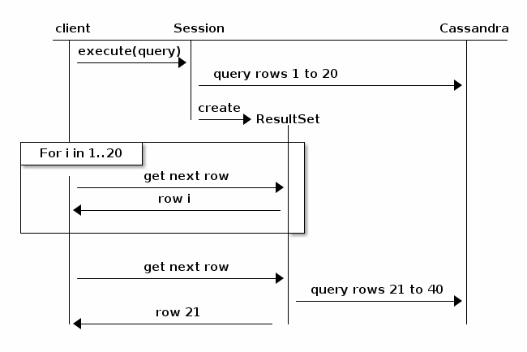
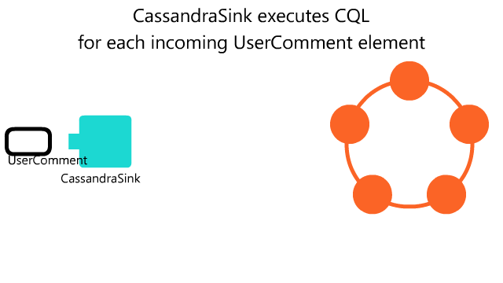
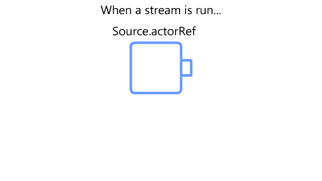
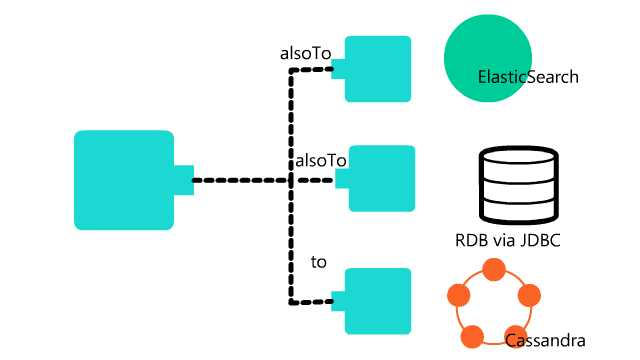
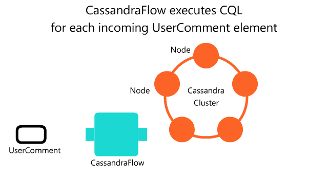

## Background

Enterprise Integration Patterns, EIP, provide reusable architecture patterns to construct complicated systems from simple components.
It has been a great success in the enterprise world, and although ETP itself is language-agnostic,
there have been many systems written in Java following or extending from EIP.

However, in recent years there has been a trend to rewrite systems in more stream-based fashion,
given a massive scale of data enterprise systems need to process every day,
and an increasing business demand for real-time analysis.

Alpakka is a great fit in this area - it is a Reactive Enterprise Integration library for Java and Scala, based on Reactive Streams and Akka.
It allows you easily connect your systems with other external systems and services, and perform stream-based operations.

In this article, we introduce Alpakka's Cassandra connector as an example, and see what Alpakka gives you over Cassandra's plain Java driver.

## About Alpakka

[Alpakka](https://github.com/akka/alpakka) is a community based effort collaborating with Akka maintainers at Lightbend,
and provides a large, and ever increasing number of connectors for files, queues including AMQP and Kafka, AWS/GCP/Azure services, and more.

You can see how Alpakka grew over time from Akka team's [blog post](https://akka.io/blog/news/2018/05/02/alpakka-team),
and the increased number of connectors as in the below screenshot.



Since Alpakka provides the connectors as Akka Streams operators, it's not just easy to connect your application to these other systems and services,
but you can also get benefit from Akka Streams's back-pressure support and fine-grained control over the stream at any level you want.
Akka Streams's flexible DSL makes it easy to combine different operators to perform things like buffering, throttling, branching, pub/sub, etc.
What's more, you can even create your own operators.

## About Cassandra

Cassandra is a database product originally created by Facebook, and known for its great write performance and distributed nature by design.

- https://academy.datastax.com/planet-cassandra/what-is-apache-cassandra
- http://cassandra.apache.org/

Although Cassandra is different from relational databases in many aspects, its query language CQL has some similarities to SQL,
and Cassandra indeed has a concept of tables.

If you already have existing data stored in Cassandra and want to introduce stream-based operations in your system,
or you have Akka-based or Akka Streams-based systems and looking for a database with great scalability and fault tolerance,
this blog post can be useful for you.

## Prerequisites for running Examples

### Bring up Cassandra

To follow the examples in this article, you should firstly bring up Cassandra.
If you already have Cassandra up and running, you can skip this section.

The easiest way to bring up Cassandra, if you already have Docker installed, is run it via Docker.
Make sure you expose the port 9042 so that the example code can connect to Cassandra via the port.

```
docker pull cassandra
docker run -p 127.0.0.1:9042:9042 -d cassandra
```

If you are not familiar with Docker, [download Cassandra](http://cassandra.apache.org/download/),
unarchive it, set PATH to the Cassandra bin directory

### Set up Maven and package runnable jar

The example [source code repository](https://github.com/richardimaoka/alpakka-blog-post) includes [pom.xml](https://github.com/richardimaoka/alpakka-blog-post/blob/master/pom.xml), so that you can use Maven to create a runnable jar file.
If you don't have Maven set up, go to the [Maven main page](https://maven.apache.org/), download and install it.

Then, `git clone` the example code repository, and invoke the `mvn package` command as follows:

```
> git clone https://github.com/richardimaoka/alpakka-blog-post.git
> cd alpakka-blog-post
> mvn package
```

You will see that under the `target` directory, Maven created `alpakka-blog-post-1.jar` and the `lib` directory which contains
all jar dependencies.



To run one of the examples, you can do this (replace `CassandraSourceExample` with `CassandraSinkExample` or `CassandraFlowExample` if you want to run the other examples.)

```
> java -cp "target/alpakka-blog-post-1.jar;target/lib*" com.example.CassandraSourceExample
```

If you already have Cassandra up and running, it should work here.

## CassandraSource example

Alpakka Cassandra has three different connectors, `CassandraSource`, `CassandraSink` and `CasssandraFlow`.

The first example we talk about is `CassandraSource`, which could be useful when you perform a batch-like operation
against a very large data set.



As you see in the animation, `CassandraSource` lets you run a CQL query, which fetches a `ResultSet` from Cassandra,
and passes each `Row` from the `ResultSet` as an element going through Akka Streams.
Note that the CQL query is **only run once**. It is not something that keeps polling Cassandra given some filtering criteria,
and that's why it is suitable for batch-like operations.

In a nutshell, you can create and run a stream with Alpakka Cassandra connector like below:

```java
final Statement stmt =
  new SimpleStatement("SELECT * FROM akka_stream_java_test.users").setFetchSize(100);

final RunnableGraph<NotUsed> runnableGraph =
  CassandraSource.create(stmt, session)
    .to(Sink.foreach(row -> System.out.println(row)));

runnableGraph.run(materializer);
```

and we'll see how it works in more detail as follows.

### Details of the example

The full code example can be found [here](https://github.com/richardimaoka/alpakka-blog-post/tree/master/src/main/java/com/example/CassandraSourceExample.java).

To go through the example code, you firstly need to add following import statements,

```java
// Alpakka Cassandra connector
import akka.stream.alpakka.cassandra.javadsl.CassandraSource;

// For Akka and Akka Streams
import akka.NotUsed;
import akka.actor.ActorSystem;
import akka.stream.ActorMaterializer;
import akka.stream.Materializer;
import akka.stream.javadsl.RunnableGraph;
import akka.stream.javadsl.Sink;

// For Java Cassandra driver
import com.datastax.driver.core.*;
```

and you need to initialize the following stuff before running `CassandraSource` to connect to Cassandra.

```java
// Make sure you already brought up Cassandra, which is accessible via the host and port below.
// The host and port would be driven from a config in a production environment
// but hardcoding them here for simplicity.
final Session session = Cluster.builder()
  .addContactPoint("127.0.0.1").withPort(9042)
  .build().connect();

// ActorSystem and Materializer are necessary as the underlying infrastructure to run Akka Streams
final ActorSystem system = ActorSystem.create();
final Materializer materializer = ActorMaterializer.create(system);
```

If you are not familiar with `ActorSystem` and `Materializer`, you can assume that
they are like the underlying infrastructure to run Akka Streams.
Typically there is only one instance of `ActorSystem` and only one instance of `Materializer` in your application, more precisely,
in your (OS) process.

In a production environment, you should already have a data set in Cassandra, but in this example,
we prepare a data set by ourselves before running Akka Streams with `CassandraSource`.
So let's create a keyspace and a table in Cassandra as follows:

```
final Statement createKeyspace = new SimpleStatement(
  "CREATE KEYSPACE IF NOT EXISTS akka_stream_java_test WITH REPLICATION = "
   + "{ 'class' :  'SimpleStrategy', 'replication_factor': 1 };"
);
session.execute(createKeyspace);

final Statement createTable = new SimpleStatement(
  "CREATE TABLE akka_stream_java_test.users (" +
    "id int, " +
    "name text, " +
    "age int, " +
    "PRIMARY KEY (id)" +
    ");"
);
session.execute(createTable);
```

In the above example code, we use the Cassandra Java driver to execute them so that you don't need to install
CQL client yourself to connect to Cassandra. Keyspace is what contains Cassandra tables, and you need to declare a replication
strategy when you create a keyspace. After creating the keyspace, you can create a table under it.

Now you can insert data into the table:

```java
for(int i = 1; i <= 1000; i++){
  // For simplicity we use the same name and age in this example
  String name = "John";
  int age = 35;

  // Prepared statement is typical for parameterized queries in CQL (Cassandra Query Language).
  // In production systems, it can be used to guard the statement from injection attacks, similar to SQL prepared statement.
  BoundStatement bound = prepared.bind(i, name, age);
  session.execute(bound);
}
```

Here, if you execute the following CQL query,

```
select * FROM akka_stream_java_test.users ;
```

you will get the result set like below,

```
 id  | age | name
-----+-----+------
 769 |  35 | John
  23 |  35 | John
 114 |  35 | John
 660 |  35 | John
 893 |  35 | John
  53 |  35 | John
 987 |  35 | John
 878 |  35 | John
 110 |  35 | John
 ...
 ...
```

but we will execute this query using `CassandraSource`.

To supply the query to `CassandraSource`, you should create a Statement beforehand,
using setFetchSize to set the paging size.

```java
//https://docs.datastax.com/en/developer/java-driver/3.2/manual/paging/
final Statement stmt =
  new SimpleStatement("SELECT * FROM akka_stream_java_test.users").setFetchSize(100);
```

Cassandra Java driver already has a [paging feature](https://docs.datastax.com/en/developer/java-driver/3.2/manual/paging/), (the below picture is cited from the reference Cassandra article)



so that you don't need to be afraid of your Cassandra client going out of memory by fetching a huge data set in one go.
Cassandra's paging works nicely with Akka Streams, and on top of it, Akka Streams allows fully non-blocking execution
without Cassandra driver's imperative [async-paging interface](https://docs.datastax.com/en/developer/java-driver/3.2/manual/async/#async-paging).

Finally, you can run the stream like below:

```java
final RunnableGraph<NotUsed> runnableGraph =
  CassandraSource.create(stmt, session)
    .to(Sink.foreach(row -> System.out.println(row)));

runnableGraph.run(materializer);
```

and get the following output.

```
...
Row[829, 35, John]
Row[700, 35, John]
Row[931, 35, John]
Row[884, 35, John]
Row[760, 35, John]
Row[628, 35, John]
Row[498, 35, John]
Row[536, 35, John]
...
```

### More realistic `CassandraSource` examples

This section is in progress. Should it be omitted as the article is getting too long??

Sometimes you may want to perform filtering on elements from `CassandraSource`, based on certain rules but the filtering
rules cannot simply be expressed as a CQL `where` clause. For example, the filtering rule depends on a return from an external
service call.

You can achieve this by the `mapAsync` operator, which is for external and async service call,
and the `filter` operator to filter elements.

```java
CassandraSource
  .create(stmt, session)
  .map(row -> new User(
    row.getInt("id"),
    row.getString("name"),
    row.getInt("age")
  ))
  .mapAsync(1, user -> {
    ... //make an external service call
  })
  .filter(serviceResult -> {
    ... //perform complicated filtering
  })
  .to(Sink.foreach(row -> System.out.println(row)));
```

Another example which could be useful is performing aggregation operations.
Cassandra's CQL doesn't have native support for aggregation operations unlike SQL, which has `GROUP BY` and other mechanisms to support aggregation.

- [How to perform similar group by operations - CQL described at Chris Batey's blog](http://christopher-batey.blogspot.com/2015/05/cassandra-aggregates-min-max-avg-group.html)

Using [Akka Streams's groupBy operator](https://doc.akka.io/docs/akka/2.5/stream/operators/Source-or-Flow/groupBy.html),
we can perform aggregation like below:


```java
CassandraSource
  .create(stmt, session)
  .map(row -> new User(
    row.getInt("id"),
    row.getString("name"),
    row.getInt("age")
  ))
  .groupBy(200, user -> user.age) //group by user's age
  .fold(
    akka.japi.Pair.create(0, 0),
    (accumulated, user) -> akka.japi.Pair.create(user.age, accumulated.second() + 1)
  )
  .to(Sink.foreach(accumulated ->
     System.out.println("age: " + accumulated.first() + " count: " + accumulated.second()
   )));
```

The last example about `CassandraSource` is for throttling.

Assume you have an `externalSink` which calls an non-streaming based external service on each element,
and the external service is slow in processing elements, it could be overwhelmed when you send elements too fast.

To avoid that, you can put a `throttling` operator in the middle, to control the throughput.
This is a useful technique if you know the safe throttling level in advance:

```java
CassandraSource
  .create(stmt, session)
  .map(row -> new User(
    row.getInt("id"),
    row.getString("name"),
    row.getInt("age")
  ))
  .throttle(10, java.time.Duration.ofSeconds(1))
  .to(externalSink); //Sink representing external system, like RDB, ElasticSearch, HTTP API, etc
```

## CassandraSink example

The full code example can be found [here](https://github.com/richardimaoka/alpakka-blog-post/tree/master/src/main/java/com/example/CassandraSinkExample.java).

The next example we see is CassandraSink, which lets you insert `Row`s into Cassandra as a `Sink` of the stream.

In contrast to `CassandraSource`, this is useful for more like a real-time system that keeps running where your data goes from another data source and
eventually written into Cassandra.



To run CassandraSink, the code would look like below:

```java
final PreparedStatement insertTemplate = session.prepare(
  "INSERT INTO akka_stream_java_test.user_comments (id, user_id, comment) VALUES (uuid(), ?, ?)"
);

BiFunction<UserComment, PreparedStatement, BoundStatement> statementBinder =
  (userData, preparedStatement) -> preparedStatement.bind(userData.userId, userData.comment);

final Sink<UserComment, CompletionStage<Done>> cassandraSink =
  CassandraSink.create(2, insertTemplate, statementBinder, session);

source.to(cassandraSink).run(materializer);
```

### Details of the example

In this example, we use a different table from what we used in the `CassandraSource` example.

```
final Statement createTable = new SimpleStatement(
  "CREATE TABLE akka_stream_java_test.user_comments (" +
    "id uuid, " +
    "user_id int, " +
    "comment text, " +
    "PRIMARY KEY (id)" +
  ");"
);

session.execute(createTable);
```

This table is associated with previous `users` table, where `user_comments.user_id` is reference to `users.id`.
However, there is no concept of foreign keys in Cassandra, so your application code needs to make sure the association
is kept tight (i.e. every `user_id` value in the `user_comments` table must also exist in the `users` table's `id` column).
Anyway, that is beyond the scope of this article, so let's come back to the `CassandraSink` stuff.

As you have the table in Cassandra, you can now define an associated model class in Java.

```java
public static class UserComment {
  int    userId;
  String comment;

  UserComment(int userId, String comment) {
    this.userId = userId;
    this.comment = comment;
  }
}
```

You need to create a prepared statement, to insert parameterized rows into Cassandra.
Prepared statements in Cassandra is similar to that of SQL for relational databases, and they are strong against injection attacks.

```java
final PreparedStatement insertTemplate = session.prepare(
  "INSERT INTO akka_stream_java_test.user_comments (id, user_id, comment) VALUES (uuid(), ?, ?)"
);
```

Next, you need this (probably) unfamiliar-looking `BiFunction`.

```java
BiFunction<UserComment, PreparedStatement, BoundStatement> statementBinder =
  (userComment, preparedStatement) -> preparedStatement.bind(userData.userId, userData.comment);
```

The signature of this `BiFunction` is bit complicated, but it means:
 - take `UserComment` as input
 - "bind" it to `PreparedStatement`
 - so that the bound CQL statement can be executed

Using `statementBinder`, now you can create `CassandraSink`.

```
final Sink<UserComment, CompletionStage<Done>> cassandraSink =
  CassandraSink.create(2, insertTemplate, statementBinder, session);

```

The parameter `2` in `CassandraSink.create(2, ...)` specifies the parallelism on writing into Cassandra.
We'll discuss about the parallelism bit later in this article.

For easiness, we can provide a data source as simple as below and run the stream:

```java
Source<UserComment, NotUsed> source =
  Source.from(Arrays.asList(1, 2, 3, 4, 5, 6, 7, 8, 9, 10))
    .map(i -> new UserComment(i, "some comment"))

source.to(cassandraSink).run(materializer);
```

however, let's do something smarter and more useful here.

You can use `Source.actorRef` to connect a `Sink` to an `Actor`,



```java
final Source<UserComment, ActorRef> source = Source.actorRef(4, OverflowStrategy.fail());

// Stream 1
final ActorRef actorRef =
  source
  .to(cassandraSink)  //to() takes the left materialized value, (i.e.) source's ActorRef
  .run(materializer);
```

and pass this `ActorRef` to provide input from whatever data source you like.


```java
// Stream 2
Source.from(Arrays.asList(1, 2, 3, 4, 5, 6, 7, 8, 9, 10))
  // throttling the stream so that the Source.actorRef() does not overflow
  .throttle(1, Duration.of(50, ChronoUnit.MILLIS))
  .map(i -> new UserComment(i, "some comment"))
  //actorRef below is connected to CassandraSink
  .to(Sink.actorRef(actorRef, "stream completed"))
  .run(materializer);
```

For example, instead of sending elements from such a simple `int` list,
your data source can be HTTP requests from an (Akka) HTTP server,
and you can pass requests to this `ActorRef` after transforming requests to `UserComment`.

Or it could be a task queue like RabbitMQ or Kafka, which works as the data source,
and you can perform necessary operations on items from the queue and persist them to Cassandra.

### Note on parallelism

One thing to note about this example is that you can use the `parallelism` parameter of `CassandraSink` to improve throughput of the stream.
As discussed previously, Cassandra is known for its great write performance, and is distributed by nature so that your
writes are balanced across different nodes in the Cassandra cluster, not hammering a single node, as long as your table
defines the appropriate Cassandra persistence key.

So, chances are that you can insert into Cassandra parallelly to achieve faster `CassandraSink` than your data source,
which is a good thing and contributes to the stability of your entire stream.

## More realistic examples

It is often the case that you want to persist or send elements to multiple different destinations.

```java
source
  .alsoTo(elasticSearchSink)
  .alsoTo(jdbcSink)
  .to(cassandraSink)
  .run(materializer);
```



Be careful on using `alsoTo` though, because:

- failure on a single destination Sink can make the entire stream fail,
- and if a single destination gets stuck and does not pull demand, all the other destinations get stuck too with back-pressure

So, you would probably need to control the failure for each destination.

## CasandraFlow example

The full code example can be found [here](https://github.com/richardimaoka/alpakka-blog-post/tree/master/src/main/java/com/example/CassandraFlowExample.java).

The last example we see is `CassandraFlow`. `CassandraFlow` allows you persist each element coming through
the `CassandraFlow` operator similar to `CassandraSink`, but the difference is that it also emits the element
after the CQL insert statement is finished.



In short, you can run `CassandraFlow` like below.

```java
final PreparedStatement insertTemplate = session.prepare(
  "INSERT INTO akka_stream_java_test.user_comments (id, user_id, comment) VALUES (uuid(), ?, ?)"
);

BiFunction<UserComment, PreparedStatement, BoundStatement> statementBinder =
  (userData, preparedStatement) -> preparedStatement.bind(userData.userId, userData.comment);

final Flow<UserComment, UserComment, NotUsed> cassandraFlow =
  CassandraFlow.createWithPassThrough(2, insertTemplate, statementBinder, session, system.dispatcher());

source.via(cassandraFlow).to(sink).run(materializer);
```

The above example is similar to `CassandraSink`, so we are not going too much detail about the example again.
Also, what we discussed in the note about the `CassandraSink` parallelism applies to `CassandraFlow` too.

### More realistic example

One good use case of `CassandraFlow` is replacement for DB polling.

It is a common requirement that you want to perform a certain operation whenever there is a new row inserted into a database.
A traditional way to achieve this is to periodical DB polling - query the database (e.g.) every X minutes,
and if you find new rows inserted, perform operations on them. To see if there are new rows inserted,
the client which polls the database remembers the last element processed, and only fetches rows which
are newer than that timestamp.

Using `CassandraFlow`, you can achieve such an operation "triggered by new insertion" in a more straightforward manner.
Whenever insertion to Cassandra succeeds, you can perform the operation.

```java
source
  .via(cassandraFlow)
  .via(someOperation)
  .to(sink)
  .run(materializer);
```

## Summary

Hopefully the examples shown in this article are interesting to you. There are a lot more capabilities in Akka Streams,
and also Alpakka is not limited to Cassandra connectors. Please visit the Akka Streams documentation and the Alpakka
project page if you want to explore more.

- [Akka Streams official documentation](https://doc.akka.io/docs/akka/2.5.5/scala/stream/index.html)
- [Alpakka project page](https://developer.lightbend.com/docs/alpakka/current/)